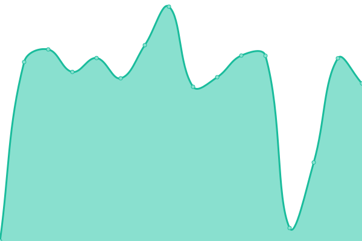
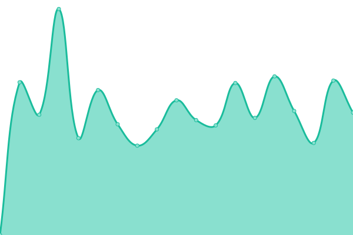
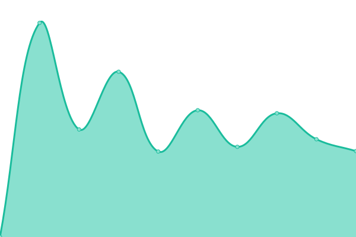
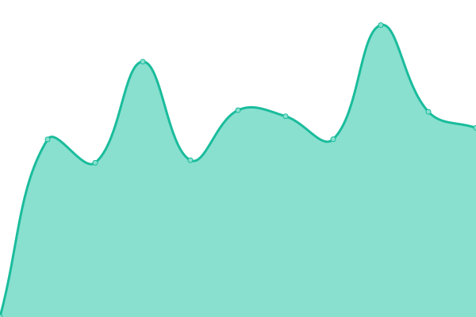
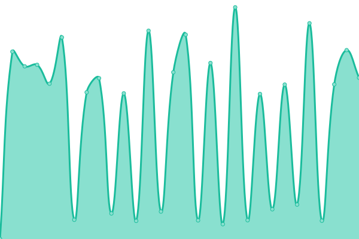

# [📈 Live Status](https://ilpuglio.github.io/upptime-monitor): <!--live status--> **🟩 All systems operational**

This repository contains the open-source uptime monitor and status page for [Gianni Puglisi](https://ilpuglio.github.io/upptime-monitor), powered by [Upptime](https://github.com/upptime/upptime).

With [Upptime](https://upptime.js.org), you can get your own unlimited and free uptime monitor and status page, powered entirely by a GitHub repository. We use [Issues](https://github.com/ilpuglio/upptime-monitor/issues) as incident reports, [Actions](https://github.com/ilpuglio/upptime-monitor/actions) as uptime monitors, and [Pages](https://ilpuglio.github.io/upptime-monitor) for the status page.

<!--start: status pages-->
<!-- This summary is generated by Upptime (https://github.com/upptime/upptime) -->
<!-- Do not edit this manually, your changes will be overwritten -->
<!-- prettier-ignore -->
| URL | Status | History | Response Time | Uptime |
| --- | ------ | ------- | ------------- | ------ |
|  [Gruppo A2A](https://gruppoa2a.it) | 🟩 Up | [gruppo-a2-a.yml](https://github.com/ilpuglio/upptime-monitor/commits/HEAD/history/gruppo-a2-a.yml) | 

 3460ms
     
 | 

<a href="https://ilpuglio.github.io/upptime-monitor/history/gruppo-a2-a">100.00%</a>
    

|  [Amsa](https://amsa.it) | 🟩 Up | [amsa.yml](https://github.com/ilpuglio/upptime-monitor/commits/HEAD/history/amsa.yml) | 

 2599ms
     
 | 

<a href="https://ilpuglio.github.io/upptime-monitor/history/amsa">100.00%</a>
    

|  [Amsa tradotto](https://yourlanguage.amsa.it) | 🟩 Up | [amsa-tradotto.yml](https://github.com/ilpuglio/upptime-monitor/commits/HEAD/history/amsa-tradotto.yml) | 

 2305ms
     
 | 

<a href="https://ilpuglio.github.io/upptime-monitor/history/amsa-tradotto">100.00%</a>
    

|  [Aprica](https://aprica.it) | 🟩 Up | [aprica.yml](https://github.com/ilpuglio/upptime-monitor/commits/HEAD/history/aprica.yml) | 

 4065ms
     
 | 

<a href="https://ilpuglio.github.io/upptime-monitor/history/aprica">100.00%</a>
    

|  [Aprica tradotto](https://yourlanguage.apricaspa.it) | 🟩 Up | [aprica-tradotto.yml](https://github.com/ilpuglio/upptime-monitor/commits/HEAD/history/aprica-tradotto.yml) | 

 1961ms
     
 | 

<a href="https://ilpuglio.github.io/upptime-monitor/history/aprica-tradotto">100.00%</a>
    

|  [A2A Calore e Servizi](https://a2acaloreservizi.it) | 🟩 Up | [a2-a-calore-e-servizi.yml](https://github.com/ilpuglio/upptime-monitor/commits/HEAD/history/a2-a-calore-e-servizi.yml) | 

 3527ms
     
 | 

<a href="https://ilpuglio.github.io/upptime-monitor/history/a2-a-calore-e-servizi">100.00%</a>
    

|  [A2A Ciclo Idrico](https://a2acicloidrico.it) | 🟩 Up | [a2-a-ciclo-idrico.yml](https://github.com/ilpuglio/upptime-monitor/commits/HEAD/history/a2-a-ciclo-idrico.yml) | 

 3408ms
     
 | 

<a href="https://ilpuglio.github.io/upptime-monitor/history/a2-a-ciclo-idrico">100.00%</a>
    

|  [A2A Illuminazione Pubblica](https://www.a2ailluminazionepubblica.eu) | 🟩 Up | [a2-a-illuminazione-pubblica.yml](https://github.com/ilpuglio/upptime-monitor/commits/HEAD/history/a2-a-illuminazione-pubblica.yml) | 

 1442ms
     
 | 

<a href="https://ilpuglio.github.io/upptime-monitor/history/a2-a-illuminazione-pubblica">100.00%</a>
    

<!--end: status pages-->

[**Visit our status website →**](https://ilpuglio.github.io/upptime-monitor)

## 📄 License

- Powered by: [Upptime](https://github.com/upptime/upptime)
- Code: [MIT](./LICENSE) © [Anand Chowdhary](https://anandchowdhary.com), supported by [Pabio](https://pabio.com)
- Data in the `./history` directory: [Open Database License](https://opendatacommons.org/licenses/odbl/1-0/)
