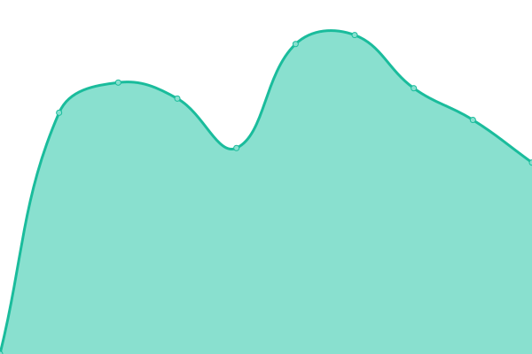
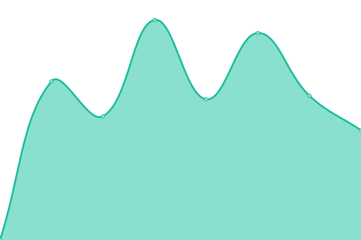
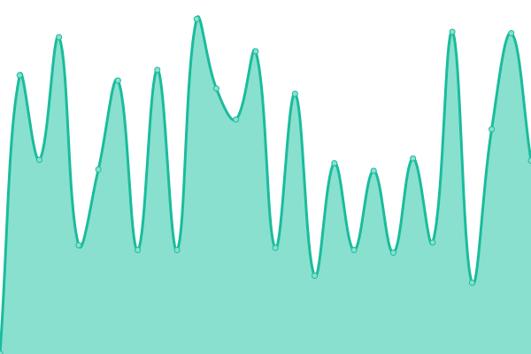
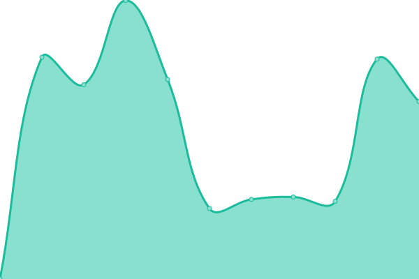
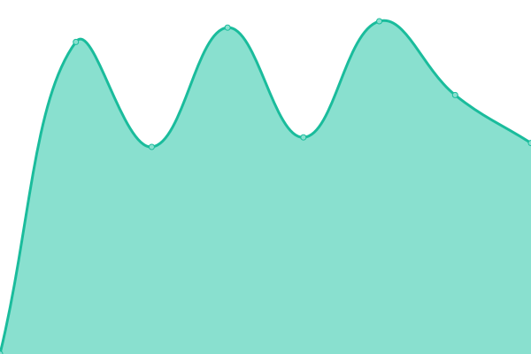
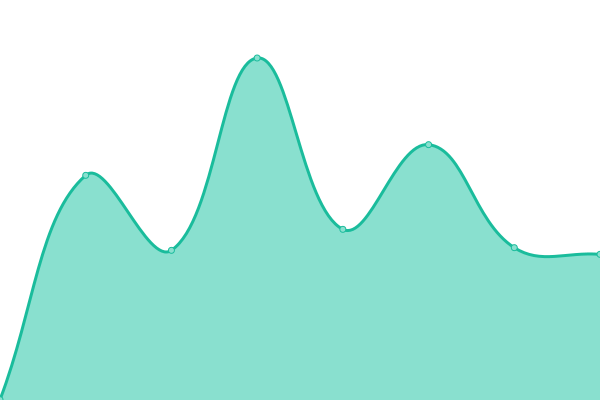
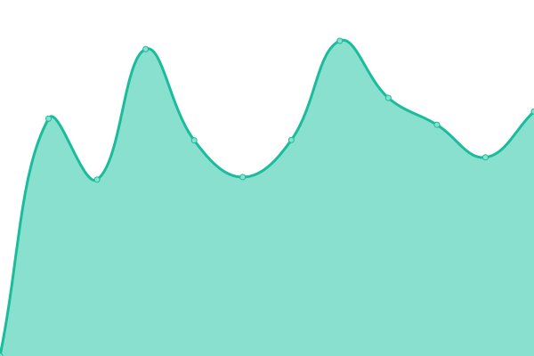

# [📈 Live Status](https://ilpuglio.github.io/upptime-monitor): <!--live status--> **🟧 Partial outage**

This repository contains the open-source uptime monitor and status page for [Gianni Puglisi](https://ilpuglio.github.io/upptime-monitor), powered by [Upptime](https://github.com/upptime/upptime).

With [Upptime](https://upptime.js.org), you can get your own unlimited and free uptime monitor and status page, powered entirely by a GitHub repository. We use [Issues](https://github.com/ilpuglio/upptime-monitor/issues) as incident reports, [Actions](https://github.com/ilpuglio/upptime-monitor/actions) as uptime monitors, and [Pages](https://ilpuglio.github.io/upptime-monitor) for the status page.

<!--start: status pages-->
<!-- This summary is generated by Upptime (https://github.com/upptime/upptime) -->
<!-- Do not edit this manually, your changes will be overwritten -->
<!-- prettier-ignore -->
| URL | Status | History | Response Time | Uptime |
| --- | ------ | ------- | ------------- | ------ |
|  [Gruppo A2A](https://www.gruppoa2a.it) | 🟩 Up | [gruppo-a2-a.yml](https://github.com/ilpuglio/upptime-monitor/commits/HEAD/history/gruppo-a2-a.yml) | 

 3509ms
     
 | 

<a href="https://ilpuglio.github.io/upptime-monitor/history/gruppo-a2-a">100.00%</a>
    

|  [Amsa](https://www.amsa.it) | 🟩 Up | [amsa.yml](https://github.com/ilpuglio/upptime-monitor/commits/HEAD/history/amsa.yml) | 

 2416ms
     
 | 

<a href="https://ilpuglio.github.io/upptime-monitor/history/amsa">100.00%</a>
    

|  [Amsa tradotto](https://yourlanguage.amsa.it) | 🟩 Up | [amsa-tradotto.yml](https://github.com/ilpuglio/upptime-monitor/commits/HEAD/history/amsa-tradotto.yml) | 

 3038ms
     
 | 

<a href="https://ilpuglio.github.io/upptime-monitor/history/amsa-tradotto">99.80%</a>
    

|  [Aprica](https://www.apricaspa.it) | 🟩 Up | [aprica.yml](https://github.com/ilpuglio/upptime-monitor/commits/HEAD/history/aprica.yml) | 

 2655ms
     
 | 

<a href="https://ilpuglio.github.io/upptime-monitor/history/aprica">100.00%</a>
    

|  [Aprica tradotto](https://yourlanguage.apricaspa.it) | 🟩 Up | [aprica-tradotto.yml](https://github.com/ilpuglio/upptime-monitor/commits/HEAD/history/aprica-tradotto.yml) | 

 2119ms
     
 | 

<a href="https://ilpuglio.github.io/upptime-monitor/history/aprica-tradotto">100.00%</a>
    

|  [A2A Calore e Servizi](https://www.a2acaloreservizi.it) | 🟩 Up | [a2-a-calore-e-servizi.yml](https://github.com/ilpuglio/upptime-monitor/commits/HEAD/history/a2-a-calore-e-servizi.yml) | 

 3355ms
     
 | 

<a href="https://ilpuglio.github.io/upptime-monitor/history/a2-a-calore-e-servizi">100.00%</a>
    

|  [A2A Ciclo Idrico](https://www.a2acicloidrico.it) | 🟩 Up | [a2-a-ciclo-idrico.yml](https://github.com/ilpuglio/upptime-monitor/commits/HEAD/history/a2-a-ciclo-idrico.yml) | 

 3627ms
     
 | 

<a href="https://ilpuglio.github.io/upptime-monitor/history/a2-a-ciclo-idrico">100.00%</a>
    

|  [A2A Illuminazione Pubblica](https://www.a2ailluminazionepubblica.eu) | 🟩 Up | [a2-a-illuminazione-pubblica.yml](https://github.com/ilpuglio/upptime-monitor/commits/HEAD/history/a2-a-illuminazione-pubblica.yml) | 

 1800ms
     
 | 

<a href="https://ilpuglio.github.io/upptime-monitor/history/a2-a-illuminazione-pubblica">100.00%</a>
    

|  [A2A Airport Energy](https://www.a2aairportenergy.it) | 🟩 Up | [a2-a-airport-energy.yml](https://github.com/ilpuglio/upptime-monitor/commits/HEAD/history/a2-a-airport-energy.yml) | 

 1117ms
     
 | 

<a href="https://ilpuglio.github.io/upptime-monitor/history/a2-a-airport-energy">100.00%</a>
    

|  [ASVT](https://www.asvt-spa.it) | 🟩 Up | [asvt.yml](https://github.com/ilpuglio/upptime-monitor/commits/HEAD/history/asvt.yml) | 

 721ms
     
 | 

<a href="https://ilpuglio.github.io/upptime-monitor/history/asvt">100.00%</a>
    

|  [Camuna Energia](https://www.camunaenergia.eu) | 🟩 Up | [camuna-energia.yml](https://github.com/ilpuglio/upptime-monitor/commits/HEAD/history/camuna-energia.yml) | 

 526ms
     
 | 

<a href="https://ilpuglio.github.io/upptime-monitor/history/camuna-energia">100.00%</a>
    

|  [Duereti](https://www.duereti.it) | 🟩 Up | [duereti.yml](https://github.com/ilpuglio/upptime-monitor/commits/HEAD/history/duereti.yml) | 

 6390ms
     
 | 

<a href="https://ilpuglio.github.io/upptime-monitor/history/duereti">100.00%</a>
    

|  [Unareti](https://www.unareti.it) | 🟩 Up | [unareti.yml](https://github.com/ilpuglio/upptime-monitor/commits/HEAD/history/unareti.yml) | 

 2576ms
     
 | 

<a href="https://ilpuglio.github.io/upptime-monitor/history/unareti">100.00%</a>
    

|  [Gruppo AEB](https://www.aebonline.it) | 🟩 Up | [gruppo-aeb.yml](https://github.com/ilpuglio/upptime-monitor/commits/HEAD/history/gruppo-aeb.yml) | 

 3023ms
     
 | 

<a href="https://ilpuglio.github.io/upptime-monitor/history/gruppo-aeb">97.67%</a>
    

|  [Gelsia Ambiente](https://www.gelsiambiente.it) | 🟩 Up | [gelsia-ambiente.yml](https://github.com/ilpuglio/upptime-monitor/commits/HEAD/history/gelsia-ambiente.yml) | 

 2540ms
     
 | 

<a href="https://ilpuglio.github.io/upptime-monitor/history/gelsia-ambiente">97.67%</a>
    

|  [H2 Valcamonica](https://www.h2valcamonica.eu) | 🟩 Up | [h2-valcamonica.yml](https://github.com/ilpuglio/upptime-monitor/commits/HEAD/history/h2-valcamonica.yml) | 

 595ms
     
 | 

<a href="https://ilpuglio.github.io/upptime-monitor/history/h2-valcamonica">100.00%</a>
    

|  [A2A Innovation](https://innovation.gruppoa2a.it) | 🟩 Up | [a2-a-innovation.yml](https://github.com/ilpuglio/upptime-monitor/commits/HEAD/history/a2-a-innovation.yml) | 

 2490ms
     
 | 

<a href="https://ilpuglio.github.io/upptime-monitor/history/a2-a-innovation">100.00%</a>
    

|  [A2A Scuole](https://scuole.gruppoa2a.it) | 🟩 Up | [a2-a-scuole.yml](https://github.com/ilpuglio/upptime-monitor/commits/HEAD/history/a2-a-scuole.yml) | 

 2427ms
     
 | 

<a href="https://ilpuglio.github.io/upptime-monitor/history/a2-a-scuole">100.00%</a>
    

|  [LD Reti](https://www.ldreti.it) | 🟥 Down | [ld-reti.yml](https://github.com/ilpuglio/upptime-monitor/commits/HEAD/history/ld-reti.yml) | 

 0ms
     
 | 

<a href="https://ilpuglio.github.io/upptime-monitor/history/ld-reti">0.00%</a>
    

|  [Retipiù](https://www.retipiu.it) | 🟩 Up | [retipiu.yml](https://github.com/ilpuglio/upptime-monitor/commits/HEAD/history/retipiu.yml) | 

 1592ms
     
 | 

<a href="https://ilpuglio.github.io/upptime-monitor/history/retipiu">100.00%</a>
    

|  [Retragas](https://www.retragas.it) | 🟩 Up | [retragas.yml](https://github.com/ilpuglio/upptime-monitor/commits/HEAD/history/retragas.yml) | 

 716ms
     
 | 

<a href="https://ilpuglio.github.io/upptime-monitor/history/retragas">100.00%</a>
    

|  [A2A Virtual Tour](https://virtualtour.gruppoa2a.it) | 🟩 Up | [a2-a-virtual-tour.yml](https://github.com/ilpuglio/upptime-monitor/commits/HEAD/history/a2-a-virtual-tour.yml) | 

 775ms
     
 | 

<a href="https://ilpuglio.github.io/upptime-monitor/history/a2-a-virtual-tour">100.00%</a>
    

|  [Linea Gestioni](https://www.linea-gestioni.it) | 🟩 Up | [linea-gestioni.yml](https://github.com/ilpuglio/upptime-monitor/commits/HEAD/history/linea-gestioni.yml) | 

 2699ms
     
 | 

<a href="https://ilpuglio.github.io/upptime-monitor/history/linea-gestioni">100.00%</a>
    

|  [BSD](https://www.brucasenzafrontiere.it) | 🟩 Up | [bsd.yml](https://github.com/ilpuglio/upptime-monitor/commits/HEAD/history/bsd.yml) | 

 365ms
     
 | 

<a href="https://ilpuglio.github.io/upptime-monitor/history/bsd">100.00%</a>
    

<!--end: status pages-->

[**Visit our status website →**](https://ilpuglio.github.io/upptime-monitor)

## 📄 License

- Powered by: [Upptime](https://github.com/upptime/upptime)
- Code: [MIT](./LICENSE) © [Anand Chowdhary](https://anandchowdhary.com), supported by [Pabio](https://pabio.com)
- Data in the `./history` directory: [Open Database License](https://opendatacommons.org/licenses/odbl/1-0/)
